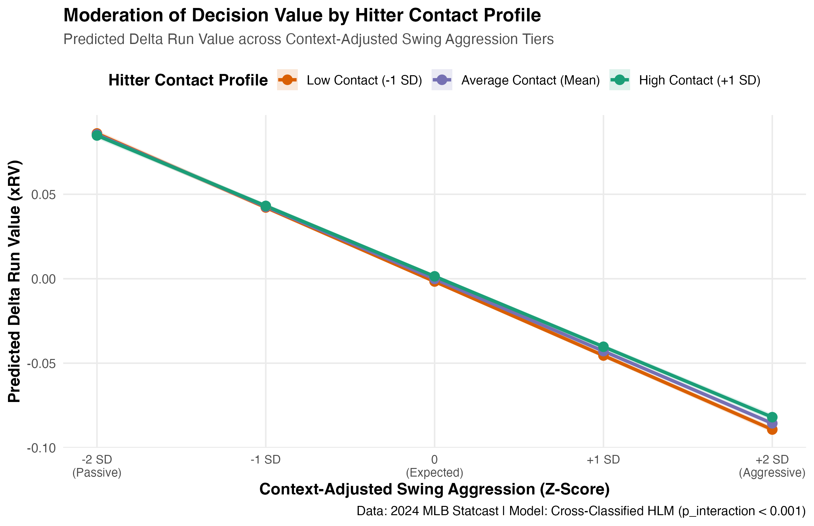

# ⚾ Context-Adjusted Swing Decisions & Hitter Contact Moderation

> **A Cross-Classified Hierarchical Linear Model (HLM) evaluating pitch-level decision value ($\Delta\text{RV}$) across the 2024 MLB Regular Season (653,990 Pitches).**

---

## 📌 Executive Summary

Traditional swing-decision metrics evaluate plate discipline through strict spatial zones (e.g., Zone% vs. Chase%). However, an optimal swing decision is highly dependent on situational context and individual skill profiles. A high-contact hitter can profitably expand the zone, whereas a low-contact power hitter incurs a steep cost when swinging aggressively in fringe locations.

This project implements a **Cross-Classified Hierarchical Linear Model (HLM)** using C++ Template Model Builder (`glmmTMB`) to quantify:
1. How **context-adjusted swing aggression** impacts pitch-level Delta Run Value ($\Delta\text{RV}$).
2. How a hitter's **baseline contact profile** moderates the payoff of aggressive swing decisions.

---

## 🛠️ Key Findings & Empirical Results

Analyzing **653,990 regular-season pitches** from 2024 yielded high-precision estimates:

* **Main Effect of Swing Aggression ($z = -157.34, p < 0.001$):** Holding all else equal, undisciplined swing expansion carries a severe penalty ($\beta = -0.0428$ run value per standard deviation of aggression).
* **Significant Positive Interaction ($z = 3.92, p < 0.001$):** The interaction term ($\beta = +0.0011$) confirms that **high-contact hitters mitigate the penalty of swing aggression**. 
* **Hard-Contact Premium ($z = 14.53, p < 0.001$):** Elite exit velocity capability ($\text{EV}_{95}$) significantly boosts expected run value ($\beta = +0.0055$), serving as a strong main-effect control.

---

## 📐 Mathematical Formulation

The pitch-level outcome $\Delta\text{RV}_{ijk}$ (for pitch $i$, faced by batter $j$ against pitcher $k$) is modeled as:

$$\Delta\text{RV}_{ijk} = \beta_0 + \beta_1 \text{Aggression}_{ijk} + \beta_2 \text{ContactRate}_j + \beta_3 (\text{Aggression}_{ijk} \times \text{ContactRate}_j) + \boldsymbol{\Gamma}\mathbf{X}_{ijk} + u_j + v_k + \epsilon_{ijk}$$

Where:
* $\text{Aggression}_{ijk}$: Context-standardized swing probability metric ($Z$-score).
* $\text{ContactRate}_j$: Batter $j$'s underlying contact rate ($Z$-score).
* $`\mathbf{X}_{ijk}`$: Vector of situational controls (Count state dummies, Platoon advantage, Hard-contact potential $`\text{EV}_{95}`$, Outs state, and Lagged $`\Delta\text{RV}`$).
* $u_j \sim \mathcal{N}(0, \sigma^2_u)$: Random intercepts for **Batters** (~600 clusters).
* $v_k \sim \mathcal{N}(0, \sigma^2_v)$: Random intercepts for **Pitchers** (~800 clusters).

---

## 📊 Full Model Summary Table

*Dataset: 2024 MLB Regular Season ($N = 653,990$ pitch observations)*

| Term | Estimate | Std. Error | Statistic ($z$) | $p$-value |
| :--- | :---: | :---: | :---: | :---: |
| **(Intercept)** | `-0.0024` | `0.0007` | `-3.43` | **$< 0.001$** |
| **`swing_aggression_z`** | `-0.0428` | `0.0003` | `-157.34` | **$< 0.001$** |
| **`baseline_contact_rate_z`** | `0.0017` | `0.0004` | `4.69` | **$< 0.001$** |
| **`platoon_advantage`** | `0.0041` | `0.0006` | `6.80` | **$< 0.001$** |
| **`ev_95_z`** | `0.0055` | `0.0004` | `14.53` | **$< 0.001$** |
| **`lag_delta_rv`** | `0.0195` | `0.0082` | `2.39` | **`0.0169`** |
| **`outs_z`** | `0.0001` | `0.0003` | `0.29` | `0.7721` |
| **`swing_aggression_z : baseline_contact_rate_z`** | **`0.0011`** | **`0.0003`** | **`3.92`** | **$< 0.001$** |

*(Note: 11 Count-state factor levels are controlled for in estimation; base state = `0-0` count).*

---

## 📈 Interaction Trajectory Visualization

Below is the marginal prediction curve generated from the cross-classified HLM:



### Key Takeaway:
When swing aggression increases from $-2$ SD (passive) to $+2$ SD (highly aggressive), **high-contact batters maintain a higher expected run value ceiling** compared to low-contact hitters, whose decision efficiency degrades significantly faster under aggressive expansion.

---

## 💻 Repository Structure & Reproducibility

```text
├── 01_scrape_full_2024_season.R    # Resilient Statcast API scraper (653k+ rows)
├── 02_fit_glmmTMB_hlm.R            # Feature engineering & glmmTMB model estimation
├── 03_summary_and_visualization.R  # Marginal effects & high-res ggplot2 generation
├── interaction_plot.png            # Saved publication-ready graphic
└── README.md                       # Project documentation
